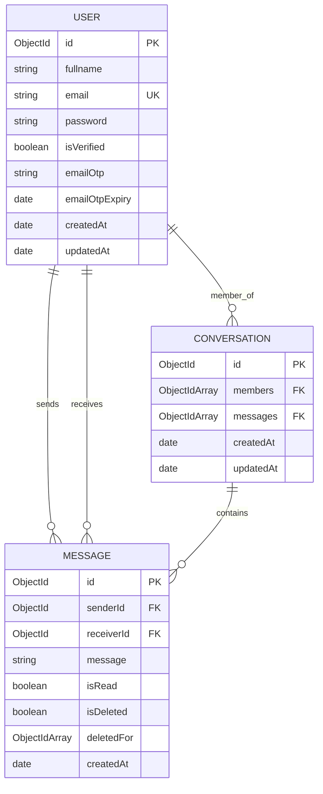

# ChatFlow Backend Documentation

This document outlines the database schema and entity relationships for the ChatFlow backend.

## Entity Relationship (ER) Diagram

## Architecture Overview
- **Node.js & Express**: Core API framework.
- **MongoDB & Mongoose**: NoSQL database for flexible chat data storage.
- **Socket.io**: Handled via a dedicated `SocketIO/server.js` to manage real-time event broadcasting and user online status tracking.
- **JWT Authentication**: Secure stateless authentication for all message and user endpoints.
