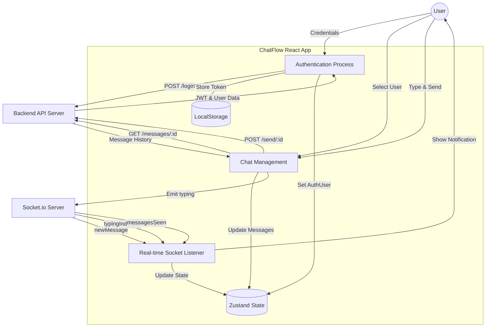

# ChatFlow Frontend Documentation

This document outlines the architecture and data flow of the ChatFlow frontend application.

## Data Flow Diagram (DFD)

## Key Components
- **Zustand**: Manages global state for conversations and messages.
- **SocketContext**: Provides a global socket instance for real-time events.
- **useGetSocketMessage**: Custom hook that handles all incoming socket events (Seen, Deleted, Typing, New Message).
- **Glassmorphic UI**: Custom CSS system defined in `index.css` using backdrop-filters and indigo-violet gradients.
